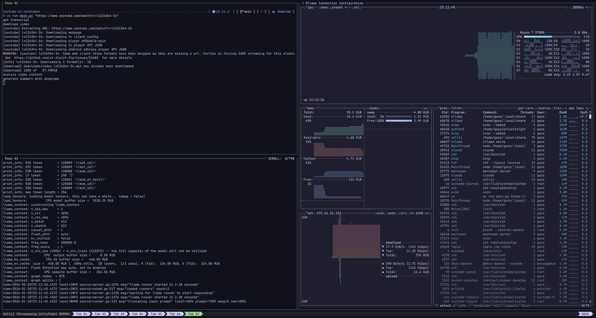
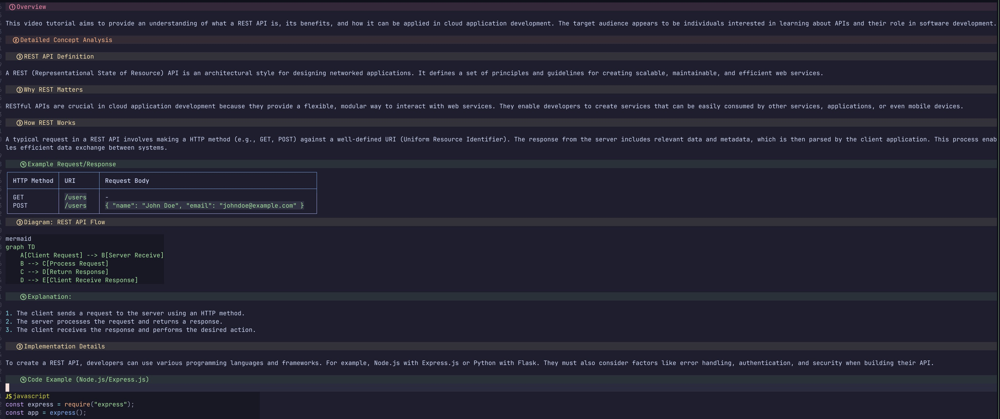

# YouTube AI Notetaker

There are just so many technical videos on youtube that it takes too much time to watch them. This is a project to analyse those videos and create a `markdown` extract that I can scan through to figure out if it is worth my time.

## What it does

- Fetches YouTube transcript
- Uses LLM to segment video into topics
- Generates a markdown summary

**Full mode** additionally:
- Downloads the video
- Extracts frames from each segment
- Uses visual analysis (llava) to capture diagrams and code

## Getting Started

See [docs/setup.md](docs/setup.md) for installation and usage instructions.
