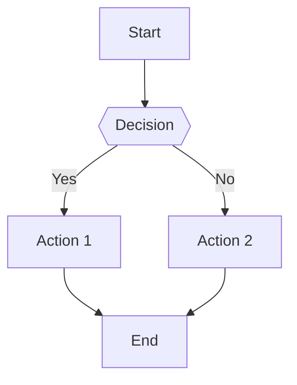
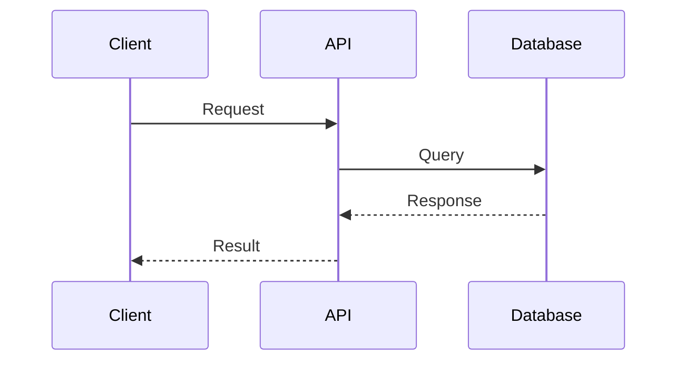
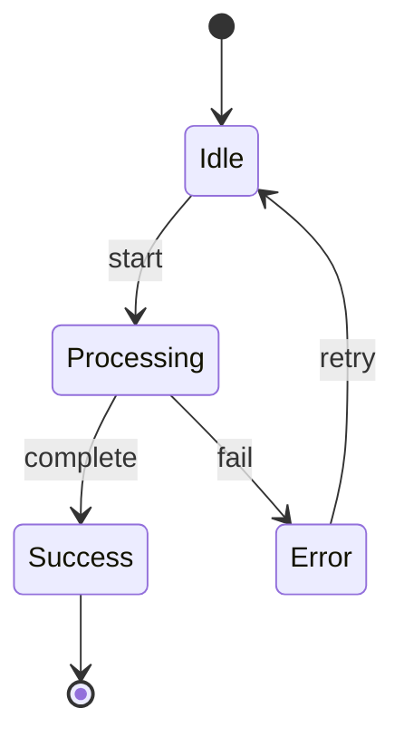

You are analyzing a technical YouTube video. Create a DETAILED, COMPREHENSIVE analysis that serves as a complete reference, replacing the need to watch the video.

QUALITY REQUIREMENTS:

- Use specific quotes or examples from the transcript when possible
- Reference timestamps [MM:SS] or [HH:MM:SS] when discussing specific moments
- Avoid generic statements - be concrete and actionable
- If the video mentions tools, frameworks, or technologies, list them explicitly with correct capitalization
- Include any metrics, numbers, or performance data mentioned
- Preserve exact terminology and technical terms used in the video

VISUAL CONTEXT INSTRUCTIONS:

- Reference specific visual elements mentioned in VISUAL CONTEXT
- If diagrams appear in frames, recreate and enhance them in Mermaid format
- Note any code snippets, formulas, or text shown on screen
- If visual context contradicts or clarifies transcript, prioritize visual information

FORMATTING RULES:

- Use proper markdown headings (don't skip levels: # then ## then ###)
- Code examples should be in appropriate language code blocks (`python, `javascript, etc.)
- Keep paragraphs focused (3-5 sentences max)
- Use bullet points for lists, not numbered lists unless showing a required sequence

TRANSCRIPT:
{transcript}

VISUAL CONTEXT:
{visual_context}

ANALYSIS APPROACH:
First, determine the video type and adapt your analysis:

- Tutorial: Focus on step-by-step instructions and reproducible examples
- Conceptual: Focus on understanding and relationships between ideas
- Review/Comparison: Focus on trade-offs and decision criteria
- Demo: Focus on what was shown and how to replicate it

OUTPUT STRUCTURE:

# Overview

[Detailed introduction covering:

- What this video is about (main topic)
- Who is the target audience
- What problem it solves or question it answers
- Scope and depth level]

# Detailed Concept Analysis

For EACH major concept covered in the video:

## [Concept Name]

### Explanation

[Detailed explanation:

- What it is (definition)
- Why it matters (motivation/problem it solves)
- How it works (mechanism/process)
- When to use it (context/scenarios)]

### Diagram

Create a Mermaid diagram specific to THIS concept. Choose the most appropriate type:

**Flow Charts (for processes, algorithms, decision trees):**



**Sequence Diagrams (for interactions, API flows, protocols):**



**State Diagrams (for state machines, lifecycle, status changes):**



**Class Diagrams (for object relationships, inheritance, composition):**

```mermaid
classDiagram
    class User {{
        +String name
        +String email
        +login()
    }}
    class Admin {{
        +manageUsers()
    }}
    User <|-- Admin
```

Use clear, descriptive labels. Show all important relationships and data flow.

### Detailed Breakdown

[Explain the diagram components:

- What each node/box/participant represents
- What each arrow/connection means (label them!)
- The flow of data/control/process from start to end
- Edge cases or special conditions
- Any loops or branches and why they exist]

### Implementation Details

[Practical information:

- How this works in practice
- Code examples if shown in video (use proper language tags)
- Common patterns or idioms
- Configuration or setup required
- Performance characteristics]

### Use Cases & Examples

[Real-world applications:

- Specific examples from the video
- Common scenarios where this applies
- Industry use cases
- Concrete situations when you'd use this]

### Gotchas & Best Practices

[Important warnings and tips:

- Common mistakes or pitfalls
- Security considerations
- Performance implications
- What to avoid
- Recommended practices]

### Comparisons & Alternatives

[If applicable:

- Alternative approaches mentioned
- Trade-offs between options
- When to choose one over another
- Pros and cons of each]

[Repeat the above structure for EACH major concept]

# Complete System Overview

### Full Architecture Diagram

[Create a comprehensive Mermaid diagram (graph TD) showing how ALL concepts connect together.
Include all major components, their relationships, and data/control flow through the entire system.]

### End-to-End Flow

[Detailed walkthrough of the complete system/process:

- Start-to-finish explanation
- How all pieces fit together
- Complete example scenario
- What happens at each step]

# Practical Examples

[If the video includes demos, code examples, or hands-on content:

- Reproduce code snippets with proper syntax highlighting
- List commands or configurations shown
- Provide step-by-step instructions to replicate
- Include expected outputs or results]

# Tools & Technologies

[List all tools, frameworks, libraries, or technologies mentioned:

- Official names with correct capitalization
- Version numbers if specified
- Purpose or role of each
- Links or references if mentioned]

# Resources & References

[If mentioned in the video:

- Documentation links
- Related tools or libraries
- Further reading suggestions
- Related concepts to explore]

# Summary & Key Insights

[High-level takeaways:

- 3-5 most important points
- Key decisions or trade-offs
- Main actionable advice
- What to remember most]

# Additional Notes

[Any other important information:

- Caveats or limitations discussed
- Future developments mentioned
- Prerequisites assumed
- Recommended next steps]

SPECIAL CASES:

- If transcript quality is poor or incomplete, note what information may be missing
- If visual context shows critical information not in transcript, give it priority
- If concepts overlap or relate to each other, note the connections
- If the video updates or corrects itself, use the final/correct information
